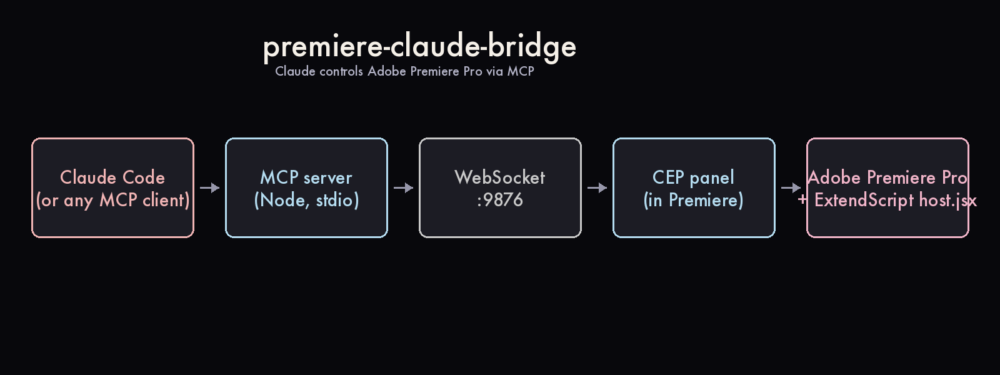

# premiere-claude-bridge

> **Control Adobe Premiere Pro from Claude — with Walter Murch's editing operating system baked in.**
>
> The first MCP bridge to Premiere Pro built by an actual film director, not by a hackathon team.

[](LICENSE)
[](https://modelcontextprotocol.io/)
[](#status)
[](#contributing)



**What you get in one sentence.** A bridge that lets Claude (or any MCP client) drive Premiere Pro on your Mac/PC the same way an assistant editor would — import dailies, build sequences, set in/out points, place markers, queue AME exports — but driven by natural-language prompts and an opinionated editing skill drawn from Walter Murch's *In the Blink of an Eye*.

**Why an editor would actually use this:**

- ⏱ **Auto-log 100+ raw clips in 12 minutes** instead of 4 hours of manual review (motion + audio peaks + horizon tilt + 6-frame strips per clip → one HTML contact sheet)
- ✂️ **Build a 60-second teaser from natural-language prompts** ("make a 60-second cut: hook → absurd → action → breath → payoff")
- 🎯 **Apply Murch's Rule of Six** — every cut decision ranked Emotion (51%) > Story (23%) > Rhythm (10%) > Eye-trace (7%) > 2D (5%) > 3D (4%)
- 🎬 **Watch any clip end-to-end** — the bundled `/watch` skill extracts ~30-100 frames + transcript (free local Whisper or Groq cloud)
- 🤖 **No Adobe AI gating** — Adobe's official Creative Cloud connector explicitly cannot control desktop Premiere ([their docs say so](skills/film-editing/SKILL.md#xiii-analysis-pipeline-)). This bridge fills that gap.

[**See full Grave Stakes case study →**](examples/grave-stakes-teaser/) (108 raw .MTS clips → 61-sec teaser, 7 minutes of work, 3 sequence iterations)

---

## Demo

```
You:    "Open Premiere. Import all .MTS from ~/Desktop/Footage/.
        Create a 1080p25 sequence called 'Rough'. Place clips
        00118 (1-6s), 00149 (4-9s), 00130 (1-5s) on V1 in order.
        Add markers at every emotional beat per Murch's hierarchy."

Claude: ✓ Imported 108 clips into bin '01_Source_MTS'
        ✓ Created Rough — 1920x1080, 25fps, 3 V / 6 A tracks
        ✓ Placed 3 clips on V1, total 14 sec
        ✓ Marked 5 emotional beats: HOOK @0s, COMEDY @5s,
          PIT @8s, BREATH @11s, PAYOFF @13s
```

→ Real output from this exact prompt. See [`examples/grave-stakes-teaser/cutlist_v3.json`](examples/grave-stakes-teaser/cutlist_v3.json) for the full 12-clip cutlist that built the case-study teaser.

---

## Quickstart

### Prerequisites

- **Adobe Premiere Pro 2024+** on macOS or Windows
- **Node.js 20+** for the MCP server
- **Claude Code** ([install](https://claude.ai/download)) or any MCP-compatible client
- **Python 3.11+** + **ffmpeg** for the analysis tools

### 1. Clone and install

```bash
git clone https://github.com/koptsev63/premiere-claude-bridge.git
cd premiere-claude-bridge
cd mcp-server && npm install && cd ..
```

### 2. Register the MCP server

Add to your `~/.claude.json` (Claude Code) or your client's MCP config:

```json
{
  "mcpServers": {
    "premiere": {
      "command": "node",
      "args": ["/absolute/path/to/premiere-claude-bridge/mcp-server/server.js"]
    }
  }
}
```

### 3. Install the CEP panel into Premiere

**macOS:**
```bash
defaults write com.adobe.CSXS.11 PlayerDebugMode 1
defaults write com.adobe.CSXS.12 PlayerDebugMode 1
ln -sf "$(pwd)/cep-extension" \
  ~/Library/Application\ Support/Adobe/CEP/extensions/com.koptsev.claude-bridge
```

**Windows (PowerShell admin):**
```powershell
New-ItemProperty -Path "HKCU:\Software\Adobe\CSXS.11" -Name PlayerDebugMode -Value 1 -PropertyType String -Force
New-ItemProperty -Path "HKCU:\Software\Adobe\CSXS.12" -Name PlayerDebugMode -Value 1 -PropertyType String -Force
mklink /D "$env:APPDATA\Adobe\CEP\extensions\com.koptsev.claude-bridge" "$(Get-Location)\cep-extension"
```

Restart Premiere → **Window → Extensions → Claude Bridge** → green "Connected to Claude".

### 4. (Optional) Enable the analysis tools

```bash
pip install -U pillow opencv-python-headless openai-whisper
brew install yt-dlp ffmpeg          # macOS
# Linux: sudo apt install ffmpeg && pip install yt-dlp
```

`openai-whisper` is the offline transcription backend for `/watch` — no API key needed, works on Hungarian/Russian/etc. far better than the cloud `whisper-1`.

→ **Detailed install + troubleshooting:** [`docs/install.md`](docs/install.md)

---

## Why this vs other Premiere MCP servers

There are three or four community Premiere-MCP attempts. Here's how this one is positioned differently:

| | Other MCP servers | **premiere-claude-bridge** |
|---|---|---|
| **Origin** | Hackathon, dev-tooling mindset | Built by a working film director who needed it for actual festival submissions |
| **Editing logic** | "269 tools across 28 modules" — flat surface area | **Walter Murch's editing OS**: Rule of Six, blink theory, decisive moment, dreaming-in-pairs, all encoded as decision rules in `skills/film-editing/SKILL.md` |
| **Analysis** | n/a or basic ffprobe | Auto-log pipeline: motion-score + audio peaks + **horizon tilt** + 6-frame motion strips → HTML contact sheet for 100+ clips in ~12 min |
| **Video perception** | Stop-frames or text descriptions | Bundled `/watch` skill — 30-100 frames + transcript per clip, three Whisper backends including free offline |
| **Documentary workflow** | Not the focus | First-class — case study is a real documentary teaser (108 raw .MTS, 4.4 GB) |
| **Multi-language audio** | English-centric | Hungarian, Russian, Spanish — handled by local Whisper `medium`/`large-v3` |
| **Non-trivial rendering** | Just timeline ops | Auto horizon-correction during AME-equivalent ffmpeg renders |

If you just want to call ExtendScript from a chatbot, any of the alternatives works. If you want to **edit a documentary** with an AI assistant that thinks about emotion before plot, this one is for you.

---

## Why I built this

I'm a film director (festival shorts, currently developing two features in screenplay labs — *Doukhobors* in TFL Next, *Grave Stakes* in Cinéfondation). I monkey with Adobe Premiere all the time, and I burn 4-6 hours per teaser on the same boring assistant-editor work: watching all the dailies, writing notes in Excel, dragging selects to a timeline, trimming, re-timing.

I tried Adobe's own AI tools. Their official Creative Cloud connector advertises "Premiere capabilities" but the actual surface is four cloud video tools that have nothing to do with the desktop app. The Adobe docs themselves say: *for trim by timestamp, use Adobe Premiere*. So I made the thing that actually does that.

The non-obvious bit: I didn't want a chatbot that randomly clicks buttons. I wanted one that **thinks like an editor**. So the core of this repo is `skills/film-editing/SKILL.md` — Walter Murch's *In the Blink of an Eye* compressed into machine-actionable decision rules. Every cut my AI assistant proposes ranks Emotion > Story > Rhythm > Eye-trace > 2D > 3D, and I can override per shot.

It worked on my actual *Grave Stakes* teaser. I wanted other directors and editors to have the same thing without re-implementing the bridge from scratch.

---

## Tools (MCP commands Claude can call)

| Tool | What it does |
|---|---|
| `pr_status` | Bridge health check + Premiere version + active project info |
| `pr_get_project_info` | List all bins + project items (with nodeId for reference) |
| `pr_get_active_sequence` | Sequence dimensions, fps, track count |
| `pr_list_timeline` | Full track-by-track clip dump (in/out, start/end, duration) |
| `pr_get_selected` | Currently selected clips on timeline |
| `pr_get_playhead` / `pr_set_playhead` | CTI control |
| `pr_add_marker` | Place marker at given time with name + comment |
| `pr_export_ame` | Queue export to Adobe Media Encoder with .epr preset |
| `pr_eval_jsx` | Escape hatch — run any ExtendScript code |

→ **Full tool reference + ExtendScript recipes:** [`docs/tools.md`](docs/tools.md)

## Skills

### `film-editing/`

Walter Murch's editing operating system as Claude decision rules:
- **Rule of Six** (Emotion 51% > Story 23% > Rhythm 10% > Eye-trace 7% > 2D 5% > 3D 4%)
- Blink theory, misdirection, idea cuts, dreaming in pairs, decisive moment
- Pacing tables for trailers/teasers/montage/interview/title cards
- Russian↔English terminology mapping

Plus tooling:
- `tools/analyze_clips.py` — folder → HTML contact sheet (motion + audio + horizon + strips)
- `tools/horizon_detect.py` — sky-ground segmentation + Hough fallback for tilt detection

### `watch/` *(vendored from [bradautomates/claude-video](https://github.com/bradautomates/claude-video), MIT)*

Lets Claude actually watch a clip. Extracts 30-100 frames + transcript via three Whisper backends:
- **`local`** (openai-whisper, no key, offline, free) — recommended
- **Groq `whisper-large-v3`** (cloud, fastest, ~$0.0002/min)
- **OpenAI `whisper-1`** (cloud, slowest, ~$0.006/min)

See [`skills/watch/ATTRIBUTION.md`](skills/watch/ATTRIBUTION.md) for credit and [`skills/film-editing/SKILL.md` §XIV](skills/film-editing/SKILL.md) for integrated workflow.

---

## Honest limitations

The bridge gives Claude full programmatic control of Premiere. With the `watch` skill bundled, the previous "stop-frames only" limitation is **largely closed**. What remains:

- **Sub-frame timing intuition.** Murch-level "trim 8 frames" calls still need a human editor.
- **Micro-expression nuance.** Frames + transcript get you 80% of the way; the last 20% is taste.
- **Dramaturgy from nothing.** Structure must be specified — the skill won't invent the through-line.

Position it as: **senior assistant editor + automation, not director's editor.**

---

## Roadmap

- [x] v0.1 — MCP bridge + film-editing skill + analyze_clips
- [x] v0.2 — `/watch` skill bundled, local Whisper, horizon detection v2
- [ ] **v0.3 — `trailer-bridge` skill pack** — 7 genre-specific recipes (action, drama, comedy, horror, doc, thriller, romance) + LUT presets + auto-rendering
- [ ] **v0.4 — multicam audio sync** — match camera angles by audio waveform xcorr, build multicam clips programmatically
- [ ] **v0.5 — face/sentiment detection** — mediapipe pass per clip → "where is the actor's most emotional moment in this take?"
- [ ] **v0.6 — MCP Registry publish** — official listing + GitHub Action for auto-release
- [ ] **v1.0 — Premiere alternatives** — same bridge for DaVinci Resolve (Lua API) and Final Cut Pro (FCPXML)

→ Want to claim one? [Open an issue with `claim` label](https://github.com/koptsev63/premiere-claude-bridge/issues/new?labels=claim).

---

## Contributing

PRs, issues, and skill packs are welcome — see [`CONTRIBUTING.md`](CONTRIBUTING.md) for the short guide.

**Easiest ways to help:**
- 🐛 [Open an issue](https://github.com/koptsev63/premiere-claude-bridge/issues) if anything in the install steps doesn't work on your OS
- 🎬 Submit a `SKILL.md` for a genre you know (music videos, podcasts, sports, weddings)
- 📺 Record a 60-second screencast of your own use case → I'll pin it in the README
- 🌐 Translate the `film-editing` SKILL.md to your language

Look for [`good first issue`](https://github.com/koptsev63/premiere-claude-bridge/issues?q=label%3A%22good+first+issue%22) and [`help wanted`](https://github.com/koptsev63/premiere-claude-bridge/issues?q=label%3A%22help+wanted%22) labels.

---

## Architecture

See [`docs/architecture.md`](docs/architecture.md). Notable design choices:

- **Multi-instance-safe WS server** — if a previous Claude session holds port 9876, new instances retry every 3s until the holder dies. Without this, multiple Claude sessions silently break.
- **ExtendScript JSON polyfill** — Adobe never shipped JSON in their ES3 engine. Without the polyfill, every typed tool fails on `JSON.stringify`.
- **Self-healing socket lookup** — adopts live `wss.clients[0]` if the cached `panelSocket` goes stale after a CEP panel reload.

These were all real bugs found during the *Grave Stakes* case study. See [`CHANGELOG.md`](CHANGELOG.md).

---

## License

MIT — see [`LICENSE`](LICENSE). The vendored `skills/watch/` is also MIT, copyright Bradley Bonanno — see [`skills/watch/ATTRIBUTION.md`](skills/watch/ATTRIBUTION.md).

---

## Status

🟡 **Beta v0.2.** Tested end-to-end on real festival-bound documentary footage (Grave Stakes, 108 raw .MTS clips, 4.4 GB). Currently in private testing with ~20 invited editors before public launch.

**Want a beta seat?** Subscribe to the dev TG channel [@koptsev_AI](https://t.me/koptsev_AI) — beta invitations + new skill packs announced there.

**Author:** Vladimir Koptsev — film director, Barcelona. [TG @koptsev_AI](https://t.me/koptsev_AI) · [koptsev63@gmail.com](mailto:koptsev63@gmail.com)
